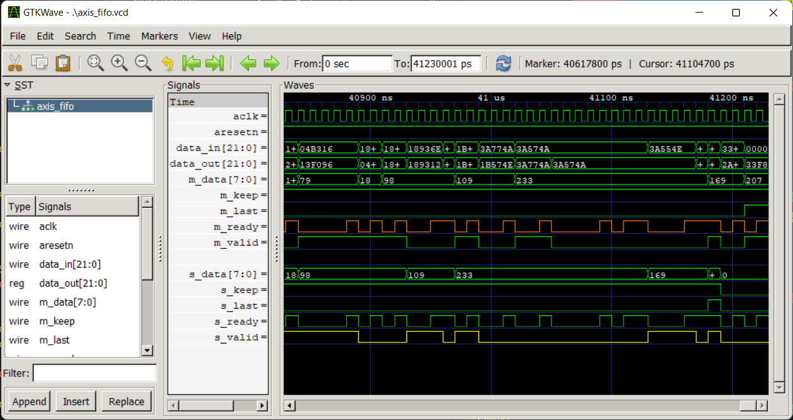

# Cocotb + Icarus: Setup, Test, Learn

[Cocotb](https://github.com/cocotb/cocotb) is an open-source python-based alternative to SystemVerilog testbenches. Since python is a productive high-level language with a rich ecosystem of well-maintained libraries such as numpy, tensorflow and pytorch, using python for verification allows the direct usage of those libraries. Cocotb does not simulate the testbench itself. Instead, it interfaces with any of the following simulators:

* Icarus-Verilog
* Verilator
* Synopsys VCS
* Cadence Incisive
* [and more](https://docs.cocotb.org/en/stable/simulator_support.html)

While Verilator is a fast & widely used open-source simulator, I could not find an easy way to install it in windows. Therefore, I will use icarus-verilog.

Cocotb-test is a pytest-based library that wraps around cocotb and simplifies the make system. Advantages are:

* Specifying makefile is also done in python
* Can run the same test with different parameters automatically

## Setup

### 1. Operating System: Windows-WSL or Linux

While icarus is powerful and accurate, the subset of SystemVerilog syntax it supports differs between its windows and linux binaries. If we write & test code in Windows setup and push to Github actions, where we use ubuntu (windows seems hard to setup in actions), it will throw minor syntax errors for advanced features, which is pain. So let us standardize our setups in Ubuntu.

If you have ubuntu, you can skip this step. If you have windows 10+, get WSL2 (Windows subsystem for linux). This installs a well-integrated linux subsystem inside windows, from which you can access files, install and run any linux software...etc. Open powershell as administrator and type the following. [More details in official guide] (https://docs.microsoft.com/en-us/windows/wsl/install)

```
wsl -- install
```

You can then enter the WSL2 terminal and use it as native linux by either:

1. Typing `wsl` in powershell
2. Open a WSL2 terminal (in parallel to a powershell terminal, if you like) in VS Code


### 2. Install Icarus Verilog (Simulator) in WSL/Linux

Icarus-Verilog (iverilog) is a powerful, open source simulator. To install [(full guide)](https://iverilog.fandom.com/wiki/Installation_Guide):

```
sudo apt get install iverilog
```

* [More Icarus downloads](https://bleyer.org/icarus/)
* [GTK Wave download](http://gtkwave.sourceforge.net/) - just extract the zip

### 3. Setup Anaconda in WSL/Linux

Anaconda is a package manager for python. It allows you to maintain multiple environments, install and use python packages without worrying about dependency conflicts. Anaconda is quite heavy (batteries included), with lot of unnessasary python packages. Miniconda is a minimalist version of anaconda.

1. Download either Anaconda or Miniconda for Linux
   1. Anaconda: `64-Bit (x86) Installer` from [here](https://www.anaconda.com/products/distribution#linux)
   2. Miniconda `Miniconda3 Linux 64-bit` from [here](https://docs.conda.io/en/latest/miniconda.html#linux-installers)
2. Install with: `bash <DOWNLOADED-FILE>.sh`
3. Create an environment named `verify` with packages we need: `conda create --name verify numpy matplotlib`


### 4. Install CoCoTB & CoCoTB Test:

1. Install required packages: `sudo apt-get install make gcc g++ python3 python3-dev python3-pip`
2. Activate the environment: `conda activate verify`
3. Install: `pip install cocotb cocotb-test`

### 5. On WSL2, turn display off to make Matplotlib faster

Matplotlib, the library we use to generate graphs (error analysis) takes a lot of time to initiate its GUI parts in WSL2. It is better to turn that off, since we don't use GUI. It has to be done every time you open a terminal. Therefore, better to append the following to your `~/.bashrc` file:

```
conda activate cocotb
export DISPLAY=
```

## Test

### Run example

Two example designs and corresponding testbenches have been developed:

1. _register:_ A simple D register
2. *axis_fifo:* AXI Stream FIFO tested with randomized ready, valid handshakes for different static parameters.

### Run all tests:

PyTest is a popular framework which finds, configures and runs python unit tests and generates reports. `-o log_cli=True` is needed to print the logging calls & print() statements to console (for debugging). You can specify `register/tb/` to force pytest to only look inside one folder (and its subfolders) and ignore other tests.

```
conda activate verify
pytest -o log_cli=True
```
### View Waveform

```
path/to/gtkwave.exe axis_fifo/sim_build/WIDTH=8,DEPTH=2/register.vcd
```



## Learn CoCoTB:

You can start reading the file `register/tb/test_register.py`. I have commented important details.


## Github Actions (CI/CD Pipeline)

Github actions are used to setup automated CI/CD (Continuous Integration, Continuous Development) workflow. 

That is, when you edit files, commit and push to github, Github Actions will automatically setup a cloud machine and run all our tests again, to verify that we have not introduced any errors, before merging it into the master.

Github actions are defined in `.github/workflows/verify.yml`. Currently they are defined to setup iverilog, cocotb on an ubuntu machine and run all tests, whenever a commit is pushed into any branch in origin. They also can be setup to trigger when a branch is merged into the master branch.

[Check past actions here](https://github.com/Lemurian-Labs/cocotb-example/actions)